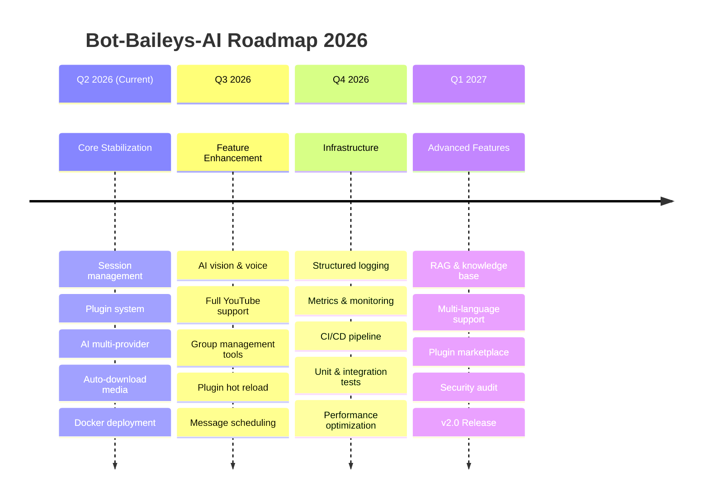

# Bot-Baileys-AI — ROADMAP.md

> Strategic roadmap for project development.
> **Versi:** 1.0.0 | **Last Updated:** 17 Juni 2026

---

## 🎯 Vision

Menjadi **WhatsApp bot open-source yang paling powerful, extensible, dan mudah digunakan** dengan ecosystem plugin yang kaya, AI multi-provider, dan arsitektur yang scalable untuk multi-session.

---

## 🗺️ Strategic Roadmap



---

## 🏁 Current Milestone: Core Stabilization (v1.0.x)

**Status:** 🟢 On Track | **Progress:** ~70%

### Completed ✅
- [x] Multi-session management dengan reconnect logic
- [x] Plugin system dengan auto-discovery
- [x] Auth state persistence ke MongoDB
- [x] AI multi-provider (OpenAI, OpenRouter, Ollama)
- [x] Social media auto-download (Instagram, TikTok, Facebook, Twitter/X, YouTube partial)
- [x] Group AI reply dengan personality system
- [x] Docker multi-stage build
- [x] Graceful shutdown handling
- [x] Session filtering (INCLUDE/EXCLUDE)
- [x] CLI argument parsing (--session, --force-clear, --only)

### In Progress 🔄
- [x] Comprehensive error recovery
- [ ] Message validation layer
- [ ] Rate limiting implementation
- [ ] YouTube full download support

### Up Next 📋
1. **Error Boundaries** — Improve error handling di setiap layer agar tidak crash session lain
2. **Rate Limiting** — Implement cooldown system per command/user
3. **YouTube Complete** — Full YouTube download dengan quality selection
4. **Structured Logging** — JSON logging untuk production debugging

---

## 🎨 Upcoming Features: Q3 2026

### AI Enhancement
- **Vision Support** — AI bisa menganalisis gambar yang dikirim user
- **Voice Notes** — Transcribe voice notes dengan AI
- **Custom Prompts** — User bisa set system prompt sendiri
- **Personality Presets** — Multiple personality templates yang bisa dipilih

### Media Download Enhancement
- **Full YouTube Support** — Video, audio, playlist
- **Playlist Support** — Download playlist TikTok, YouTube
- **Thread Download** — Download entire Twitter/X thread
- **Media Queue** — Antrian download untuk menghindari rate limit

### Group Management
- **Welcome/Goodbye** — Customizable join/leave messages
- **Anti-Spam** — Auto-detect dan remove spam
- **Scheduling** — Schedule messages for groups
- **Polls** — Built-in polling system

### Developer Experience
- **Plugin Hot Reload** — Reload plugins without restart
- **Plugin Registry** — Central registry for installed plugins
- **API Documentation** — Auto-generated docs from plugin metadata
- **TypeScript Improvements** — Better type safety across codebase

---

## 🏗️ Infrastructure: Q4 2026

### Monitoring & Observability
- **Structured Logging** — JSON format logs untuk ELK/Grafana
- **Metrics Dashboard** — Grafana dashboard untuk session health
- **Health Endpoint** — HTTP health check untuk container orchestration
- **Performance Profiling** — Identify bottlenecks regularly

### Testing
- **Unit Tests** — Jest/Vitest untuk core modules
- **Integration Tests** — Mock WhatsApp WebSocket
- **E2E Tests** — Full flow testing
- **Load Testing** — K6/similar untuk performance benchmarking

### CI/CD
- **GitHub Actions** — Automated type-check, lint, build, test
- **Automated Releases** — Semantic release with changelog
- **Docker Registry** — Automated Docker image push
- **Deployment Scripts** — One-command deploy

### Performance Optimization
- **Query Optimization** — Database query profiling
- **Caching Layer** — Redis for session & message cache
- **Memory Profiling** — Reduce memory footprint per session
- **Connection Pooling** — Optimize MongoDB connections

---

## 🚀 Advanced Features: Q1 2027 (v2.0)

### AI Platform
- **RAG System** — Chat with documents (PDF, text, web pages)
- **Knowledge Base** — Persistent knowledge base per user/group
- **AI Agent Framework** — Tool-using AI agents
- **Multi-Modal** — Full image, audio, video processing

### Ecosystem
- **Plugin Marketplace** — Registry for community plugins
- **Plugin SDK** — SDK for third-party plugin developers
- **Template System** — Project templates for new plugins
- **API Access** — REST API for external integrations

### Enterprise Features
- **Multi-Tenant** — Isolated environments per tenant
- **Audit Logging** — Complete action audit trail
- **Role-Based Access** — Granular permission system
- **Backup & Disaster Recovery** — Automated backup strategies

### Community & Documentation
- **Website/Docs** — Documentation website with examples
- **Tutorial Series** — Video/written tutorials
- **Contributor Guide** — Clear contribution guidelines
- **Community Templates** — Ready-to-use bot templates

---

## 📊 Key Metrics

| Metric | Current | Target Q3 2026 | Target Q4 2026 | Target v2.0 |
|--------|---------|----------------|----------------|-------------|
| **Commands** | 20+ | 30+ | 40+ | 60+ |
| **AI Providers** | 3 | 3 | 4 | 5+ |
| **Media Platforms** | 5 | 7 | 8 | 10+ |
| **Test Coverage** | 0% | 20% | 60% | 85%+ |
| **GitHub Stars** | - | 50+ | 200+ | 500+ |
| **Contributors** | 1 | 3+ | 5+ | 15+ |

---

## 🧪 Experimental / Research

Teknologi yang sedang dieksplorasi untuk future release:

- [ ] **WebSocket Gateway** — Bot bisa diakses via WebSocket API
- [ ] **Database Migration** — PostgreSQL as optional database (via Prisma)
- [ ] **Serverless Support** — Deploy bot sebagai serverless function
- [ ] **Desktop App** — Electron-based desktop manager untuk bot
- [ ] **Mobile Companion** — Mobile app untuk monitoring bot
- [ ] **Blockchain Integration** — Web3/blockchain features

---

## 🤝 Contribution Guide

Kami menyambut kontribusi dari siapa pun! Berikut cara berkontribusi:

1. **Fork** repository ini
2. Buat **feature branch** (`git checkout -b feature/amazing-feature`)
3. **Commit** perubahan (`git commit -m 'feat: add amazing feature'`)
4. **Push** ke branch (`git push origin feature/amazing-feature`)
5. Buka **Pull Request**

### Development Setup
```bash
# Clone repo
git clone https://github.com/yourusername/Bot-Baileys-AI.git
cd Bot-Baileys-AI

# Install dependencies
pnpm install

# Setup environment
cp .env.example .env
# Edit .env with your configuration

# Setup database
pnpm prisma:generate
pnpm prisma:migrate

# Run
pnpm dev
```

### Coding Standards
- Ikuti konvensi yang tercantum di [`AGENT.md`](AGENT.md)
- Gunakan TypeScript strict mode
- Tulis test untuk fitur baru (target: 85% coverage)
- Dokumentasikan plugin dan command baru
- Gunakan semantic commit messages (`feat:`, `fix:`, `docs:`, `refactor:`, dll)

---

## 📅 Release Timeline

| Version | Date | Focus |
|---------|------|-------|
| v1.0.0-alpha | Q2 2026 | Core functionality |
| v1.0.0-beta | Q2 2026 | Stabilization & bug fixes |
| v1.0.0 | Q3 2026 | First stable release |
| v1.1.0 | Q3 2026 | AI & media enhancements |
| v1.2.0 | Q4 2026 | Infrastructure & testing |
| v2.0.0 | Q1 2027 | Advanced features & ecosystem |

---

> **Disclaimer:** Roadmap ini bersifat dinamis dan dapat berubah sesuai dengan prioritas project dan feedback dari komunitas.
>
> **Maintainer:** Tim Bot-Baileys-AI
