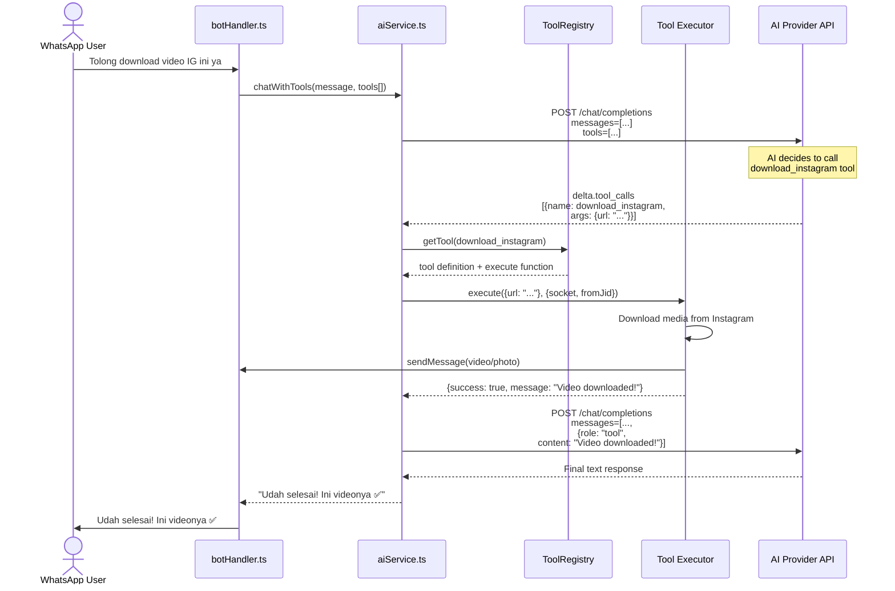

# AI Tooling System - Implementation Plan

## 1. Problem Statement

Currently, the bot uses **regex-based link detection** to trigger social media downloads. The AI cannot proactively decide to use tools — it only reacts when a link is detected. The user wants **proper AI function calling (tool use)** where:

- The AI **intelligently decides** when to call a download tool
- The user can say: *"Download this Instagram video for me"* (without even pasting a link first, the AI can ask for it)
- The system is **extensible** for future tools (web search, image generation, etc.)
- Works across **all AI providers** (OpenAI, OpenRouter, Ollama)

---

## 2. Current Architecture

```
User Message
    │
    ├──► [aiCommand.ts] ──► detectSocialMediaLink() ──► downloadFromSocialMedia()
    │       (regex only)           (regex match)           (send media)
    │
    └──► [aiService.ts] ──► No tool_calls processed
            (chat/stream)        (tools ignored)
```

**Key Gaps:**
- `aiService.ts` sends `tools` array but **never processes `tool_calls`** from AI response
- Streaming handler only reads `delta.content`, ignores `delta.tool_calls`
- No centralized tool registry
- No multi-turn function calling flow

---

## 3. Proposed Architecture

```
User Message
    │
    ├──► [aiCommand.ts / botHandler.ts]
    │         │
    │         ▼
    │   ┌─────────────────────┐
    │   │   aiService.ts      │
    │   │   (with function     │
    │   │    calling support)  │
    │   └──────┬──────────────┘
    │          │
    │          ▼
    │   ┌─────────────────────┐
    │   │   Tool Registry     │
    │   │   (src/tools/)      │
    │   └──────┬──────────────┘
    │          │
    │          ├── download_instagram(url)
    │          ├── download_tiktok(url)
    │          ├── download_facebook(url)
    │          ├── download_twitter(url)
    │          ├── download_youtube(url, format)
    │          └── pinterest_search(query)
    │
    │   AI: "call tool download_instagram"
    │        │
    │        ▼
    │   Execute tool → send media
    │        │
    │        ▼
    │   Return result to AI
    │        │
    │        ▼
    │   AI: "Here's your video!"
```

---

## 4. Detailed Implementation Steps

### Step 1: Create Tool Type Definitions (`src/types/tools.ts`)

Define TypeScript interfaces for the tooling system:

```typescript
interface AIToolParameter {
  name: string;
  type: string;
  description: string;
  required?: boolean;
}

interface AIToolDefinition {
  name: string;
  description: string;
  parameters: {
    type: 'object';
    properties: Record<string, {
      type: string;
      description: string;
    }>;
    required: string[];
  };
}

interface AIToolCall {
  id: string;
  type: 'function';
  function: {
    name: string;
    arguments: string; // JSON string
  };
}

interface AIToolResult {
  tool_call_id: string;
  role: 'tool';
  content: string;
}

type ToolExecuteFunction = (args: Record<string, any>, context: ToolContext) => Promise<ToolExecuteResult>;

interface ToolContext {
  socket?: WASocket;
  fromJid?: string;
  sessionId?: string;
}

interface ToolExecuteResult {
  success: boolean;
  message: string;
  data?: any;  // Additional structured data
}
```

### Step 2: Create Tool Registry (`src/tools/toolRegistry.ts`)

Central registry to manage all AI-accessible tools.

**Responsibilities:**
- Register tools with name, description, parameter schema, and execute function
- Look up tools by name
- Get all tool definitions for AI API calls
- Execute a tool call and return formatted results

### Step 3: Define Media Download Tools (`src/tools/definitions/`)

Each tool definition file exports both the schema and the execute function.

**Tools to implement:**

| Tool Name | Description | Source Reused |
|-----------|-------------|---------------|
| `download_instagram` | Download Instagram video/photo | `autoDownload.ts:downloadInstagram` |
| `download_tiktok` | Download TikTok video | `autoDownload.ts:downloadTikTok` |
| `download_facebook` | Download Facebook video | `autoDownload.ts:downloadFacebook` |
| `download_twitter` | Download Twitter/X video | `autoDownload.ts:downloadTwitter` |
| `download_youtube` | Download YouTube video/audio | `autoDownload.ts:downloadYouTube` |
| `pinterest_search` | Search and download Pinterest images | `utils/pinterest.ts` |

**Example tool definition:**

```typescript
// src/tools/definitions/downloadInstagram.ts
export const definition: AIToolDefinition = {
  name: 'download_instagram',
  description: 'Download media (photo or video) from Instagram. Requires a valid Instagram post/reel URL.',
  parameters: {
    type: 'object',
    properties: {
      url: {
        type: 'string',
        description: 'The Instagram URL (post, reel, or IGTV)'
      }
    },
    required: ['url']
  }
};

export async function execute(args: { url: string }, context: ToolContext): Promise<ToolExecuteResult> {
  // Reuse existing logic from autoDownload.ts
  // But return structured result instead of sending directly
}
```

### Step 4: Update `aiService.ts` with Function Calling Support

**Major changes needed:**

#### 4a. Add tool registration to AIService

```typescript
private tools: Map<string, AIToolDefinition> = new Map();

registerTool(tool: AIToolDefinition): void { ... }
getToolsForApi(): AIToolDefinition[] { ... }
```

#### 4b. Update `callOpenAICompatibleStream()` to include all registered tools

Currently only sends tools for OpenRouter. Change to send for all providers.

#### 4c. Create new method `chatWithTools()`

```typescript
async chatWithTools(
  sessionId: string,
  userMessage: string,
  systemPrompt?: string,
  onChunk?: StreamCallback,
  toolContext?: ToolContext
): Promise<string>
```

This method:
1. Sends the message with tool definitions
2. If AI response contains `tool_calls`:
   - Parse the tool calls
   - Execute each tool via ToolRegistry
   - Send tool results back to AI
   - Return AI's final response
3. If AI response is normal text, return directly

#### 4d. Handle streaming with tool calls

The SSE stream may contain:
- `delta.content` - normal text
- `delta.tool_calls` - function call requests

Need to buffer tool_calls from the stream, then after stream ends, process them.

**Streaming flow:**

```
Stream Chunks
  │
  ├── delta.content → buffer as normal response text
  │
  └── delta.tool_calls → accumulate in toolCalls array

[Stream ends]
  │
  ├── if toolCalls found:
  │      execute tools → send results back to AI
  │      → get new completion (non-stream or stream)
  │      → return final text
  │
  └── if no toolCalls:
         return buffered content as final response
```

### Step 5: Create Tool Execution Engine (`src/tools/toolExecutor.ts`)

Handles the actual execution of tool calls:

```typescript
class ToolExecutor {
  async executeToolCall(
    toolCall: AIToolCall,
    context: ToolContext
  ): Promise<AIToolResult> {
    // 1. Find tool in registry
    // 2. Parse arguments JSON
    // 3. Execute tool function
    // 4. If socket context available, send media directly to user
    // 5. Return formatted result for AI
  }

  async handleToolCalls(
    toolCalls: AIToolCall[],
    context: ToolContext
  ): Promise<AIToolResult[]> {
    // Execute all tool calls (parallel where possible)
  }
}
```

### Step 6: Update `aiCommand.ts`

Replace the current reactive approach:
```typescript
// OLD: reactive regex detection
const socialLink = detectSocialMediaLink(question);
if (socialLink) {
  await downloadFromSocialMedia(socialLink, ...);
  return;
}

// NEW: proactive tool calling
const response = await aiService.chatWithTools(
  userId, question, systemPrompt, callback, toolContext
);
// AI decides when to call download tools
```

### Step 7: Update `botHandler.ts`

Update the AI message handlers (`handleAIMessage`, `handleGroupAutoReply`) to use `chatWithTools` instead of `chatStream`.

Keep the regex auto-download as a fallback for non-AI mode messages.

### Step 8: Update System Prompt

Add tool awareness to the system prompt in `aiCommand.ts`:

```
Kemampuan Tools:
- download_instagram(url): Download video/foto dari Instagram
- download_tiktok(url): Download video dari TikTok
- download_facebook(url): Download video dari Facebook
- download_twitter(url): Download video dari Twitter/X
- download_youtube(url, format): Download video/audio dari YouTube
- pinterest_search(query): Cari gambar dari Pinterest

Gunakan tools ini saat user meminta download media sosial.
```

---

## 5. File Structure

```
src/
├── tools/                           # NEW: AI Tooling System
│   ├── index.ts                     # Re-export all tools
│   ├── toolRegistry.ts              # Central tool registry
│   ├── toolExecutor.ts              # Executes tool calls from AI
│   ├── toolContext.ts               # Context builder helper
│   └── definitions/                 # Tool definitions
│       ├── downloadInstagram.ts
│       ├── downloadTiktok.ts
│       ├── downloadFacebook.ts
│       ├── downloadTwitter.ts
│       ├── downloadYoutube.ts
│       ├── pinterestSearch.ts
│       └── index.ts                 # Re-export all definitions
│
├── services/
│   ├── aiService.ts                 # UPDATED: Add function calling
│   └── aiModeHandler.ts             # UPDATED: Use new tooling
│
├── plugins/ai/
│   └── aiCommand.ts                 # UPDATED: Use chatWithTools
│
├── bot/
│   └── botHandler.ts                # UPDATED: Use chatWithTools
│
└── types/
    └── tools.ts                     # NEW: Type definitions for tooling
```

---

## 6. Mermaid Diagram: Function Calling Flow



---

## 7. OpenAI-Compatible Tool Format

The tools must follow OpenAI's function calling format:

```json
{
  "type": "function",
  "function": {
    "name": "download_instagram",
    "description": "Download media from Instagram (photo or video)",
    "parameters": {
      "type": "object",
      "properties": {
        "url": {
          "type": "string",
          "description": "Full Instagram URL (post, reel, or IGTV)"
        }
      },
      "required": ["url"]
    }
  }
}
```

---

## 8. Implementation Order

1. **`src/types/tools.ts`** - Type definitions first (no dependencies)
2. **`src/tools/toolRegistry.ts`** - Registry system
3. **`src/tools/definitions/*`** - Individual tool definitions (can be parallel)
4. **`src/tools/toolExecutor.ts`** - Execution engine
5. **`src/tools/index.ts`** - Barrel export
6. **Update `src/services/aiService.ts`** - Core function calling support
7. **Update `src/plugins/ai/aiCommand.ts`** - Integration point 1
8. **Update `src/bot/botHandler.ts`** - Integration point 2
9. **Update `src/services/aiModeHandler.ts`** - Integration point 3

---

## 9. Key Design Decisions

| Decision | Choice | Rationale |
|----------|--------|-----------|
| Tool definitions separate from execution | Yes | Clean separation of concerns, easier to add new tools |
| Reuse existing download functions | Yes | Avoid code duplication, wrap in tool interface |
| Send tools to all providers | Yes | OpenAI, OpenRouter, and "other" OpenAI-compatible all support function calling |
| Ollama support | Limited | Ollama may not support function calling; fall back to regex-based detection |
| Streaming with tool calls | Accumulate then process | Simplifies implementation; tool calls are fast anyway |
| Send media directly vs via AI | Direct send | WhatsApp media must be sent via socket, not through AI text |
