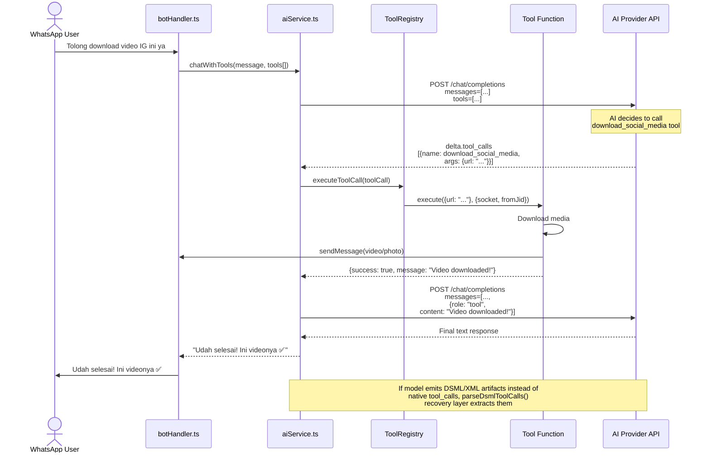

# AI Tooling System — Implementation Status

> **Status:** ✅ Fully Implemented (v1.1.0)  
> **This document** was originally created as an implementation plan. It has been updated to reflect the current state of the implementation.

---

## 1. What Was Built

The AI can now **intelligently decide** when to call tools via OpenAI-compatible function calling, including:

- **Download social media** (Instagram, TikTok, Facebook, Twitter/X)
- **Download YouTube** (video & audio)
- **Search Pinterest** (images)
- **Create gallery-dl stickers** (from URL or search keywords)
- **Fetch web pages** (via Firecrawl headless scraper)
- **Search the web** (via Firecrawl search API)

Works across all AI providers (OpenAI, OpenRouter, Ollama, and any OpenAI-compatible "other" provider).

---

## 2. Current Architecture

```
User Message
    │
    ├──► [aiCommand.ts / botHandler.ts]
    │         │
    │         ▼
    │   ┌─────────────────────────┐
    │   │   aiService.ts          │
    │   │   chatWithTools()       │
    │   │   (multi-round, max 4)   │
    │   └──────┬──────────────────┘
    │          │
    │          ▼
    │   ┌─────────────────────────┐
    │   │   ToolRegistry          │
    │   │   (src/tools/)          │
    │   │   singleton             │
    │   └──────┬──────────────────┘
    │          │
    │          ├── download_social_media(url)     ← unified IG/TikTok/FB/Twitter
    │          ├── download_youtube(url, format)
    │          ├── pinterest_search(query)
    │          ├── gallery_dl_sticker(url|query)   ← sticker creation
    │          ├── web_fetch(url)                  ← Firecrawl scrape
    │          └── web_search(query)               ← Firecrawl search
    │
    │   AI: "call tool download_social_media"
    │        │
    │        ▼
    │   Execute tool → send media directly
    │        │
    │        ▼
    │   Return result to AI
    │        │
    │        ▼
    │   AI: "Here's your video!"
    │
    │   [DSML Fallback] → If model emits tool calls
    │   as visible XML text instead of native API,
    │   parseDsmlToolCalls() recovers them.
```

**Key Gaps Closed:**
- ✅ `aiService.ts` now processes `tool_calls` from AI responses
- ✅ Streaming handler accumulates `delta.tool_calls` and processes after stream ends
- ✅ Centralized ToolRegistry singleton
- ✅ Multi-turn function calling flow (max 4 rounds)
- ✅ DSML/XML artifact recovery for models that don't support native function calling
- ✅ Tool call artifact stripping from final response

---

## 3. File Structure (Current)

```
src/
├── tools/                           # AI Tooling System
│   ├── index.ts                     # registerAllTools() barrel
│   ├── toolRegistry.ts              # Central tool registry singleton
│   └── definitions/
│       ├── index.ts                 # Registers all 6 tools
│       ├── socialDownload.ts        # Unified: IG, TikTok, FB, Twitter
│       ├── downloadYoutube.ts       # YouTube downloader
│       ├── pinterestSearch.ts       # Pinterest image search
│       ├── galleryDlSticker.ts      # gallery-dl sticker creation
│       ├── webFetch.ts              # Firecrawl web scraper
│       └── webSearch.ts             # Firecrawl web search
│
├── services/
│   ├── aiService.ts                 # chatWithTools(), tool call handling
│   ├── systemPrompt.ts              # Extracted system prompts, dynamic date
│   ├── aiModeHandler.ts             # AI mode toggle
│   └── groupToggle.ts               # Group AI toggle
│
├── plugins/ai/
│   └── aiCommand.ts                 # Uses chatWithTools()
│
├── bot/
│   └── botHandler.ts                # Uses chatWithTools() for group/private
│
├── types/
│   └── tools.ts                     # AIToolDefinition, ToolContext, etc.
│
└── utils/
    ├── toolCallFilter.ts            # DSML parsing, artifact detection/stripping
    ├── twitterDownloader.ts         # yt-dlp based Twitter/X download
    ├── galleryDlSticker.ts          # gallery-dl process + sticker creation
    ├── pinterest.ts                 # Pinterest scraper (cheerio)
    ├── logger.ts                    # Logging utility
    └── youtubeButtonHandler.ts      # YouTube interactive button handler
```

---

## 4. Mermaid Diagram: Function Calling Flow



---

## 5. Implementation Details

### Tool Registry (`src/tools/toolRegistry.ts`)

Singleton pattern with these public methods:
- `register()` / `registerAll()` — Register tools
- `getApiDefinitions()` — Get OpenAI-compatible tool definitions array
- `executeToolCall()` — Execute a single tool call
- `executeToolCalls()` — Execute multiple tool calls

### aiService.ts — chatWithTools()

Core multi-round execution loop:
1. Send messages + tools to AI API
2. Check response for `tool_calls` (native) or DSML artifacts (recovery)
3. If tool calls found → execute via ToolRegistry → append results → go to step 1
4. If no tool calls → return final text
5. Max 4 rounds (`MAX_TOOL_ROUNDS`)

### DSML Tool Call Parsing

DSML (Directive System Markup Language) is a recovery mechanism for models that emit tool calls as visible text:

```
<鄽 download_social_media>
鄽鄽url: "https://instagram.com/p/xyz"
</鄽 download_social_media>
```

`parseDsmlToolCalls()` extracts these using a whitelist of allowed tool names, preventing prompt injection.

### Tool Call Artifact Filter

`stripToolCallArtifacts()` removes residual XML/JSON/tool artifacts from the final AI response text before sending to the user.

---

## 6. Key Design Decisions

| Decision | Choice | Rationale |
|----------|--------|-----------|
| Tool definitions separate from execution | ✅ | Clean separation of concerns, easier to add new tools |
| Reuse existing download functions | ✅ | Avoid code duplication, wrap in tool interface |
| Send tools to all providers | ✅ | OpenAI/OpenRouter/Ollama/'other' all supported |
| Unified social download (1 tool) | ✅ | 4 separate tools → 1 single `download_social_media` with auto-detect |
| Streaming with tool calls | Accumulate then process | Simplifies implementation; tool calls are fast anyway |
| Send media directly vs via AI | Direct send | WhatsApp media must be sent via socket, not through AI text |
| DSML artifact recovery | ✅ | Essential for models that don't emit native tool_calls |
| Max 4 tool rounds | ✅ | Prevents infinite loops while allowing multi-step tasks |
| Tool call artifact stripping | ✅ | Ensures clean responses even if model includes artifacts |

---

## 7. Future Enhancements

| Feature | Priority | Notes |
|---------|----------|-------|
| More tools (weather, calendar, etc.) | Medium | Easy to add via new definition files |
| Tool call caching/rate limiting | Low | Prevent duplicate/redundant calls |
| Better error recovery per tool | Medium | Some tools fail silently, need better feedback |
| Tool execution timeout per tool | Low | Currently uses global timeout |
